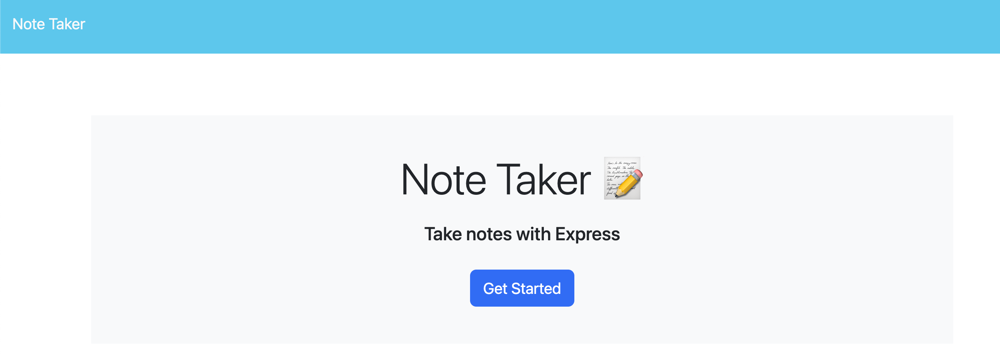
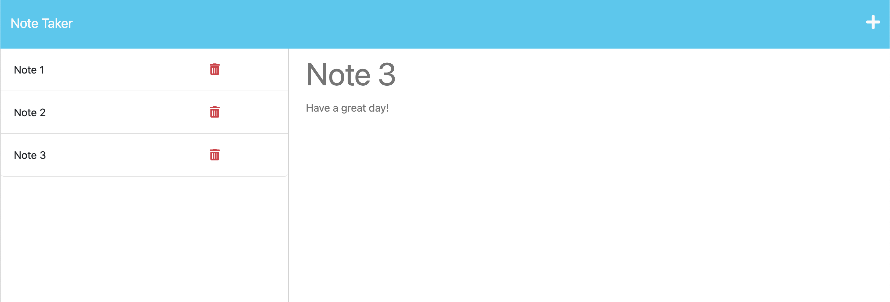

# BC11-Note-Taker

## Description:
* A simple Note Taker used to write, save and delete notes.
* This application uses an Express.js back end and will save and retrieve note data from a JSON file.
* [Video Walkthrough: Note Taker.](https://youtu.be/WEzLqaqPL2Q)

## Installation:
* Clone repository.
* Run npm install.
* Run node server.js.
* Open localhost:3001.

## Usage:
* Follow the deployed Heroku to explore. [Note Taker.](https://rekat-eton-078b6c3ecb4b.herokuapp.com/)

## Application User Interface:

## Credits & Resources:
* Google search & Youtube videos.
* ChatGpt for troubleshooting.
* Starter code EdX and UCB.
* Stack Overflow & MDN.

## Coded With:
* Express.js.
* Node.js.
* UUID.
* Heroku.
* VS Code.
* Youtube.

## Contributing:
* Any ideas or feedback is very much appreciated.

## License:
